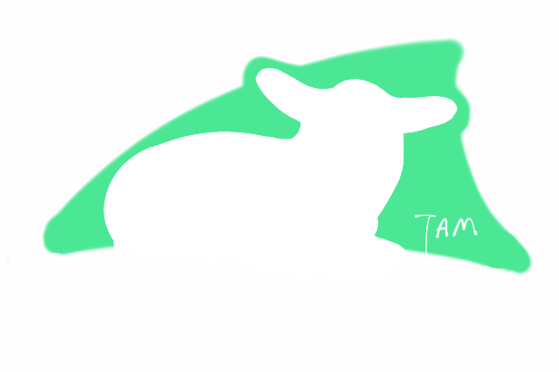

# Tam

[![npm-version][npm-badge]][npm-url]
[![build status][build-badge]][build-url]
[![coverage][coverage-badge]][coverage-url]

[npm-badge]: https://img.shields.io/npm/v/tam.svg
[npm-url]: https://www.npmjs.com/package/tam
[build-badge]: https://api.travis-ci.org/arrowrowe/tam.svg
[build-url]: https://travis-ci.org/arrowrowe/tam
[coverage-badge]: http://codecov.io/github/arrowrowe/tam/coverage.svg?branch=master
[coverage-graph]: http://codecov.io/github/arrowrowe/tam/branch.svg?branch=master
[coverage-url]: http://codecov.io/github/arrowrowe/tam?branch=master

> **T**am is the **A**ssets **M**anager for you. ~~(Tam is a tame lamb!~~



## What is Tam?

Use Tam to copy, compress, combine, compile and hash static files for packages with dependencies, providing a resource list for each package.

Tam is still evolving. (Always 100% coverage!)

[![coverage][coverage-graph]][coverage-url]

## Install

### as a library
```sh
npm i --save-dev tam
```

### as a tool
```sh
npm i -g tam
```

## Usage

### Sample Assets

```javascript
// assets.json
{
  "src": "resources/assets",  // Required.
  "dist": "public/static",    // Required. All output files will be generated here.
  "www": "public",            // Required. It MUST be under dist.
  "linked": "linked.json",    // Required if you use Tam from commandline.
  "option": {                 // Optional. The global option.
    "mode": ["copy", 1],      // Optional. Set to mode `copy` with priority 1. It is default.
    "hash": [0, 0]            // Optional. Hash output files with 0-length hash. (i.e., do not hash.) It is default.
    // Other option you may find useful:
    // "mode": ["compress", 2]
    // "mode": ['copy', 100]
    // "hash": [8, 1]
  },
  "packages": {   // Required. Below are sample packages.
    "angular": {
      "src": "../../node_modules/angular",  // Optional. Will be set to the package's name if left blank.
      "dist": ".",                          // Optional. Will be set to the package's name if left blank.
      "option": { // Optional.
        "mode": ["compress", 2],
        "compress": { // Pass arguments to the compressor. Tam uses UglifyJS for default.
          "warnings": false
        }
      },
      "files": ["angular.js"] // Required. MUST be a array.
    },
    "core": {
      "dependencies": ["angular"],  // Optional.
      "files": ["angular-app.js"]
    },
    "page/welcome": {
      "dependencies": ["core"],
      "files": ["app.js"]
    }
  }
}
```

If mode set to `compress`, a package named `some-pkg` with many js and css files will be compressed to only two files, `some-pkg.js` and `some-pkg.css`.

SCSS files are always compiled. The output style (expanded or compressed) depends on the mode (copy or compress). It will not be compressed into `some-pkg.js`.

Wildcard is allowed for files, `**/*.js` for example.

If hash set to a positive integer, all js and css will be renamed appended with their hashes (cut to the length set).

Note: if you run `tam` from commandline or call `tam.run()` (they are equivalent), comments in JSON will be stripped automatically by [strip-json-comments](https://www.npmjs.com/package/strip-json-comments).

### As a tool

Simply type `tam`! See also `tam -h`.

### As a library with Gulp

```javascript
// gulpfile.js
var gulp = require('gulp');
var fs = require('fs');
var tam = require('tam');

// Set log level to INFO. See also log4js.
tam.log.setLevel('INFO');

// Custom Tam if you want. See `lib/worker.js` for details.
// tam.worker.tools.compressors.js = WhateverJSCompressorYouWant;
// tam.worker.tools.compilers.scss = WhateverSCSSCompilerYouWant;

gulp.task('build', function () {
  // Equivalent to run `tam` from commandline.
  tam.run();

  // Specify arguments if you like.
  // tam.run({assets: 'assets.json', log: 'info'});

  /* Or you can do it on your own, output anything if you want to know what Tam is doing exactly.
  var assets = {};  // MUST be a valid Tam-assets object!
  var prepared = tam.prepare(assets);
  var report = tam.build(prepared);
  var linked = tam.link(report, assets.www);
  fs.writeFileSync(assets.linked, JSON.stringify(linked));
  */
});
```

### Then what?

All JavaScript and CSS files each package need can be found in `linked.json` (or somewhere else you specify). Just output them in your HTML as `script` and `link` tags, in anyway you like.

## Contribution

Feel free to open issues or send pull requests!
